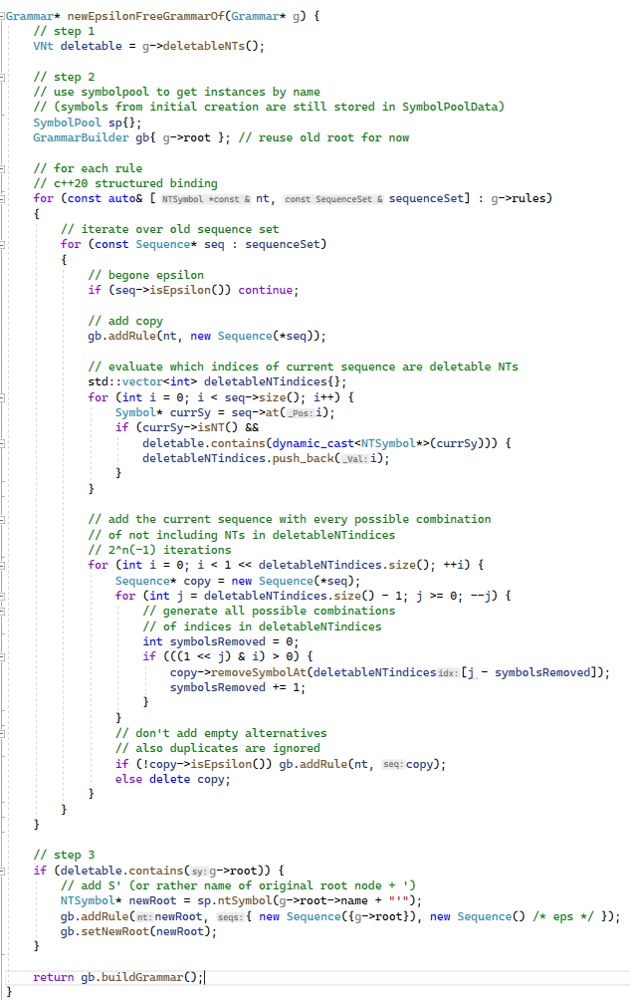
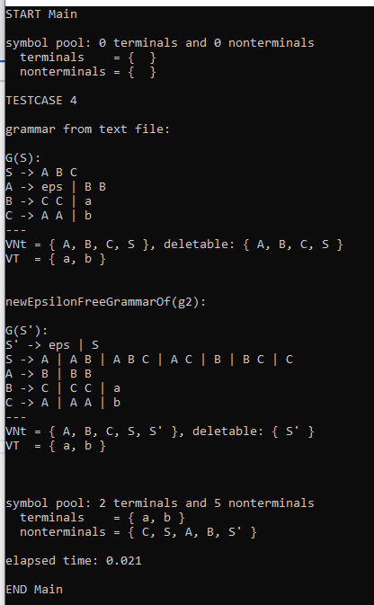

# 1. Grammatiken – Grundbegriffe

## a)

| VT(G) = { `"DATA"`, `","`, `"/"`, `"*"`, `id`, `num`, `str`, `"+"`, `"-"`, `"("`, `")"`, `"="`, `expr` } | = 13

| VN(G) = { `DataDecl`, `DataDeclRest`, `DataNameList`, `DataValueList`, `DataName`, `DataNameList`, `DataDoList`, `DataValue`, `DataDoListRest` } | = 9

## b) 

shortest:
* `DATA id / num /`
* `DATA id / str /` 
* `DATA id / id /` 

## c)

Direkt rekursiv: 
* `DataDeclRest`: links
* `DataNameList`: rechts
* `DataValueList`: links
* `DataDoList`: zentral
* `DataDoListRest`: links

Indirekt rekursiv:
* `DataDoList` => `DataDoListRest`: zentral
* `DataDoListRest` => `DataDoList`: zentral

## d)

DataStat -> "Data" DataDecl DataDeclRest .

DataDeclRest -> ε | DataDeclRest DataDecl | DataDeclRest `","` DataDecl .

DataDecl -> DataNameList `"/"` DataValueList `"/"` .

DataNameList -> DataName | DataName `","` DataNameList .

DataName -> id | DataDoList .

DataValueList -> DataValue | DataValueList `","` DataValue .

DataValue -> OptSign num | str | id 
* | num `"*"` id 
* | num `"*"` OptSign num 
* | num `"*"` str 
* | id `"*"` id
* | id `"*"` OptSign num
* | id `"*"` str
* .

OptSign -> ε | `"+"` | `"+"` .

DataDoList -> `"("` DataDoList DataDoListRest `")"` 
* | `"("` id `"("` IdList `")"` DataDoListRest `")"`
* .
IdList -> id | IdList `","` id .

DataDoListRest -> ε 
* | DataDoListRest `","` DataDoList 
* | DataDoListRest `","` id `"("` ExprList `")"` 
* | DataDoListRest `","` id `"="` expr `","` expr
* | DataDoListRest `","` id `"="` expr `","` expr, expr
* .

ExprList -> expr | ExprList `","` expr .

EBNF ist lesbarer, da man mit weniger Alternativen durch Verwendung von `"["` und `"]"` benötigt kann und keine Rekursion mit NTs für das mehrfache Vorkommen von \[Terminal-\]Symbolen verwenden muss.

## e)

Die Grammatik ist zwar mehrdeuting aber ich konnte keinen zweiten Syntax-Baum für diesen Satz finden.

# 2. Konstruktion einer Grammatik

## Regelsystem

S -> OptSign LeadingDigit MiddleDigits UnevenNaturalDigit | OptSign UnevenNaturalDigit . // man könnte auch OptSign weglassen und dafür 4 weitere Optionen im NT "S" hinzufügen

OptSign -> ε | + | - .

MiddleDigits -> ε | 0 MiddleDigits | LeadingDigit MiddleDigits .

UnevenNaturalDigit -> 1 | 3 | 5 | 7 | 9 .

LeadingDigit -> UnevenNaturalDigit | 2 | 4 | 6 | 8 .

## EBNF

S = \[ + | - \] \[ (1|2|3|4|5|6|7|8|9) { (0|1|2|3|4|5|6|7|8|9) } \] (1|3|5|7|9) . 

 
\pagebreak 

# 3. Oo-Implementierung von Grammatiken

No changes made to existing code. I used C++20.

## a)

### main.cpp

 
\pagebreak 

### Testcode:

### Result:

## b) and also c)

### main.cpp

 
\pagebreak 

### Language.h

 
\pagebreak 

### Language.cpp

### Testcode:

### Result:

