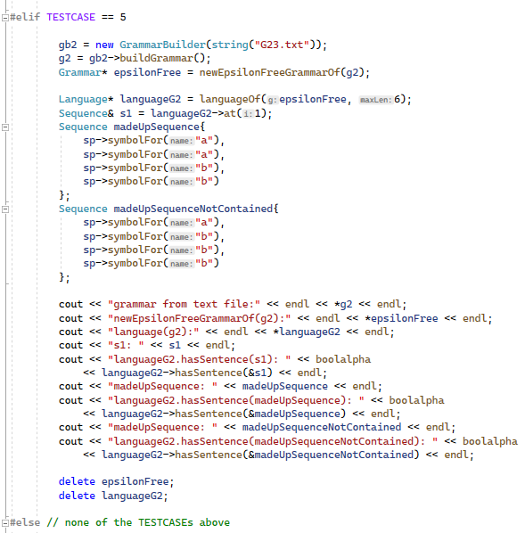

# 1. Grammatiken – Grundbegriffe

## a)

| VT(G) = { `"DATA"`, `","`, `"/"`, `"*"`, `id`, `num`, `str`, `"+"`, `"-"`, `"("`, `")"`, `"="`, `expr` } | = 13

| VN(G) = { `DataDecl`, `DataDeclRest`, `DataNameList`, `DataValueList`, `DataName`, `DataNameList`, `DataDoList`, `DataValue`, `DataDoListRest` } | = 9

## b) 

shortest:
* `DATA id / num /`
* `DATA id / str /` 
* `DATA id / id /` 

## c)

Direkt rekursiv: 
* `DataDeclRest`: links
* `DataNameList`: rechts
* `DataValueList`: links
* `DataDoList`: zentral
* `DataDoListRest`: links

Indirekt rekursiv:
* `DataDoList` => `DataDoListRest`: zentral
* `DataDoListRest` => `DataDoList`: zentral

## d)

DataStat -> "Data" DataDecl DataDeclRest .

DataDeclRest -> ε | DataDeclRest DataDecl | DataDeclRest `","` DataDecl .

DataDecl -> DataNameList `"/"` DataValueList `"/"` .

DataNameList -> DataName | DataName `","` DataNameList .

DataName -> id | DataDoList .

DataValueList -> DataValue | DataValueList `","` DataValue .

DataValue -> OptSign num | str | id 
* | num `"*"` id 
* | num `"*"` OptSign num 
* | num `"*"` str 
* | id `"*"` id
* | id `"*"` OptSign num
* | id `"*"` str
* .

OptSign -> ε | `"+"` | `"+"` .

DataDoList -> `"("` DataDoList DataDoListRest `")"` 
* | `"("` id `"("` IdList `")"` DataDoListRest `")"`
* .
IdList -> id | IdList `","` id .

DataDoListRest -> ε 
* | DataDoListRest `","` DataDoList 
* | DataDoListRest `","` id `"("` ExprList `")"` 
* | DataDoListRest `","` id `"="` expr `","` expr
* | DataDoListRest `","` id `"="` expr `","` expr, expr
* .

ExprList -> expr | ExprList `","` expr .

EBNF ist lesbarer, da man mit weniger Alternativen durch Verwendung von `"["` und `"]"` benötigt kann und keine Rekursion mit NTs für das mehrfache Vorkommen von \[Terminal-\]Symbolen verwenden muss.

## e)

Für diesen Satz gibt es nur einen Syntaxbaum, da es beim Ableiten von den Regeln immer nur eine Alternative gibt, die man verwenden kann, um am Ende diesen Satz zu bekommen.

# 2. Konstruktion einer Grammatik

## Regelsystem

S -> OptSign LeadingDigit MiddleDigits UnevenNaturalDigit | OptSign UnevenNaturalDigit . // man könnte auch OptSign weglassen und dafür 4 weitere Alternativen in "S" hinzufügen

OptSign -> ε | + | - .

MiddleDigits -> ε | 0 MiddleDigits | LeadingDigit MiddleDigits .

UnevenNaturalDigit -> 1 | 3 | 5 | 7 | 9 .

LeadingDigit -> UnevenNaturalDigit | 2 | 4 | 6 | 8 .

## EBNF

S = \[ + | - \] \[ (1|2|3|4|5|6|7|8|9) \{ (0|1|2|3|4|5|6|7|8|9) \} \] (1|3|5|7|9) . 

# 3. Oo-Implementierung von Grammatiken

No changes made to existing code. I used C++20.

## a)

### main.cpp

(next page)

### Testcode:

### Result:

## b) and also c)

### main.cpp

### Language.h

(next page)

### Language.cpp

(next page)

### Testcode:

### Result:

Man kann erkennen, dass die länge der generieten Sätze immer gerade ist und jeder Satz gleich viele `a` wie `b` hat.

Ja kann man.
Jedes NT `B` terminiert in genau ein `b` und jedes NT `A` terminiert in genau ein `a`.
Wenn die Ableitung mit `S -> a B` anfängt, dann befindet sich schon ein `a` im Satz und das `B` wird schlussendlich zu einem `b`.
Bei der dritten Alternative von `B` kommen ein `a` sowie zwei `B` hinzu.
Die Ableitung `S -> a B -> a a B B` hat 2 `a` und 2 `B` und wir wissen bereits, dass jedes `B` in genau ein `b` terminiert oder es geschieht wieder die gleiche Ableitung von `B -> a B B`, wodurch effektiv nur 1 weiteres `a` und 1 weiteres `B` hinzukommen.
Wenn schlussendlich alle `B` in `b` abgeleitet werden, gibt es gleich viele `a` wie `b`.
Das gleiche gilt auch für die Ableitung `B -> b S`, da wie bei der ersten Alternative ein weiteres `B` mit `b` ersetzt wird und ein weiterer Satz `S` dazukommt, der später auch wieder in gleich viele `a` und `b` abgeleitet werden kann und jedes `B` wieder in ein `b` abgeleitet wird oder in ein `b` und ein `S`.
Das gleiche gilt auch in die andere Richtung `S -> a B`, da die Regeln im NTSymbol `B` nur `b` und `A` mit `a` und `B` getauscht haben.