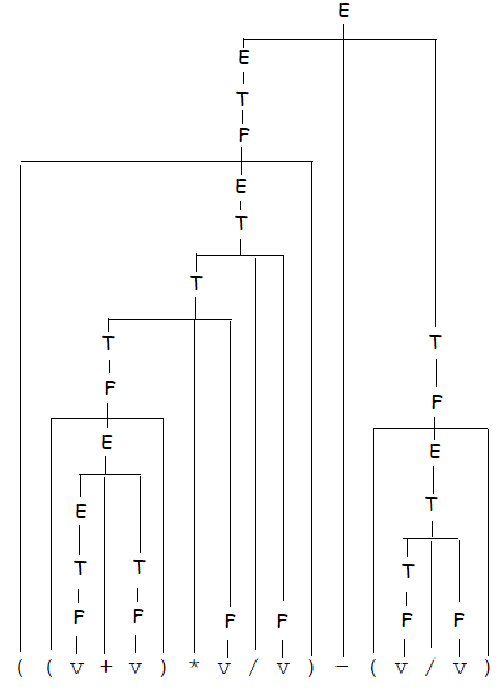
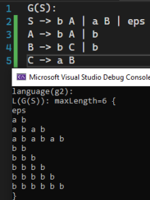
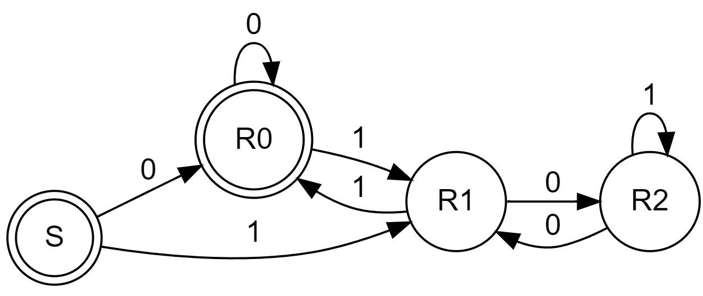

# 1. Kanonische Ableitung und Reduktion

## a)

Rechtskanonisch:

`*E*` => 

`- *T*` => 

`- T * *F*` => 

`- T * ( *E* )` => 

`- T * ( E + *T* )` => 

`- T * ( E + T / *F* )` => 

`- T * ( E + *T* / v )` => 

`- T * ( E + *F* / v )` => 

`- T * ( *E* + v / v )` => 

`- T * ( *T* + v / v )` => 

`- T * ( *F* + v / v )` => 

`- *T* * ( v + v / v )` => 

`- *F* * ( v + v / v )` => 

`- v * ( v + v / v )`

Linkskanonisch:

`*E*` => 

`- *T*` => 

`- *T* * F` => 

`- *F* * F` => 

`- v * *F*` => 

`- v * ( *E* )` => 

`- v * ( *E* + T )` => 

`- v * ( *T* + T )` => 

`- v * ( *F* + T )` => 

`- v * ( v + *T* )` => 

`- v * ( v + *T* / F )` => 

`- v * ( v + *F* / F )` => 

`- v * ( v + v / *F* )` => 

`- v * ( v + v / v )`


## b)

Rechtskanonisch:

`( ( v + v ) * v / v ) – ( v / *v* )` =>

~~`( ( v + v ) * v / v ) – ( v / *F* )` =>~~

~~`( ( v + v ) * v / v ) – ( F / T )` =>~~ 

`( ( v + v ) * v / v ) – ( *v* / F )` =>

`( ( v + v ) * v / v ) – ( *F* / F )` =>

`( ( v + v ) * v / v ) – ( *T / F* )` =>

`( ( v + v ) * v / v ) – ( *T* )` =>

`( ( v + v ) * v / v ) – *( E )*` =>

`( ( v + v ) * v / v ) – *F*` =>

`( ( v + v ) * v / *v* ) – T` =>

`( ( v + v ) * *v* / F ) – T` =>

`( ( v + *v* ) * F / F ) – T` =>

`( ( v + *F* ) * F / F ) – T` =>

`( ( *v* + T ) * F / F ) – T` =>

`( ( *F* + T ) * F / F ) – T` =>

`( ( *T* + T ) * F / F ) – T` =>

`( ( *E + T* ) * F / F ) – T` =>

`( *( E )* * F / F ) – T` =>

`( *F* * F / F ) – T` =>

`( *T * F* / F ) – T` =>

`( *T / F* ) – T` =>

`( *T* ) – T` =>

`*( E )* – T` =>

`*F* – T` =>

`*T* – T` =>

`*E – T*` =>

`E`

Syntaxbaum:



Linkskanonisch:

`( ( *v* + v ) * v / v ) – ( v / v )` =>

`( ( *F* + v ) * v / v ) – ( v / v )` =>

`( ( *T* + v ) * v / v ) – ( v / v )` =>

`( ( E + *v* ) * v / v ) – ( v / v )` =>

`( ( E + *F* ) * v / v ) – ( v / v )` =>

`( ( *E + T* ) * v / v ) – ( v / v )` =>

`( *( E )* * v / v ) – ( v / v )` =>

`( *F* * v / v ) – ( v / v )` =>

`( T * *v* / v ) – ( v / v )` =>

`( *T * F* / v ) – ( v / v )` =>

`( T / *v* ) – ( v / v )` =>

`( *T / F* ) – ( v / v )` =>

`( *T* ) – ( v / v )` =>

`*( E )* – ( v / v )` =>

`*F* – ( v / v )` =>

`*T* – ( v / v )` =>

`E – ( *v* / v )` =>

`E – ( *F* / v )` =>

`E – ( T / *v* )` =>

`E – ( *T / F* )` =>

`E – ( *T* )` =>

`E – *( E )*` =>

`E – *F*` =>

`*E – T*` =>

`E`


Die Anzahl der Reduktionen ist bei beiden Varianten gleich (24 Reduktionen) und die Syntaxbäume sind ident.

# 2. Mehrdeutigkeit, Beschreibung und Schreibweisen

## a)

Bei der Regel `frac` liegt die Mehrdeutigkeit, da man auf `n` kommen kann, indem man entweder die 1. Alternative verwendet, oder die 2. Alternative und dann das dazukommende `frac` ein `ε` ableitet.

Beispiel: `6.9`

`real` => `mant` => `sign int . frac` => `ε int . frac` => `ε n . frac` 

| option 1     | option 2          |
| ------------ | ----------------- |
| => `ε n . n` | => `ε n . frac n` |
| => `ε 6 . n` | => `ε 6 . frac n` |
| => `ε 6 . 9` | => `ε 6 . ε n`    | 
|              | => `ε 6 . 9`      | 

Änderung: `frac -> n | frac n | ε .` auf `frac -> frac n | ε .`, der Rest bleibt gleich.

## b) Äquivalänte, eindeutige Grammatik

Möglichst wenige Regeln:

`G(real):`

`real = ['+'|'-'] (0|...|9) {0|...|9} ['.' {0|...|9} ] ['E' ['+'|'-'] (0|...|9) {0|...|9}] .`

"Kürzer":

`real = optSign n {n} ['.' {n} ] ['E' optSign n {n}] .`

`optSign = ['+'|'-'] .`

`n = 0 | 1 | 2 | 3 | 4 | 5 | 6 | 7 | 8 | 9 .`

# 3. Reguläre Grammatiken

## a)

Sätze:

* ε
* ab
* ab(ab)*
* bb
* bb(b)*

(oder man verwendet die Impl. aus Übung 1):



`S -> A b | B b | ε .`

`A -> a | C a .`

`C -> A b .`

`B -> b | B b .`

## b)

`ab(ab)∗ + bb(b)* + ε` oder besser `(ab)* + (b)*` (erspaart das `ε`)


# 4. Bezeichner in der Programmiersprache Ada

## a)

`B -> l | l R`

`R -> d | l | '_' U | l R | d R`

`U -> l | d | l R | d R`

## b)

`B -> l | R l | R d`

`R -> U '_' | R l | R d | l`

`U -> R d | R l | l`

## c)

`l ( l + d + '_' l + '_' d)*`

Unix:

`l(l|d|_l|_d)*` =^= `l(_?(l|d))*` =^= `l(_?[ld])*`

# 5. Transformation zwischen Darstellungsformen regulärer Sprachen

## a)

```
digraph non_deterministic_finite_state_machine {
	fontname="Helvetica,Arial,sans-serif"
	node [fontname="Helvetica,Arial,sans-serif"]
	edge [fontname="Helvetica,Arial,sans-serif"]
	rankdir=LR;
	node [shape = doublecircle]; S A C E;
	node [shape = circle];
	
	S -> A [label = "a"]
	A -> A [label = "a"]
	S -> B [label = "a"]
	B -> C [label = "b"]
	S -> D [label = "b"]
	C -> D [label = "b"]
	C -> B [label = "a"]
	D -> E [label = "a"]
	E -> D [label = "b"]
}
```


|             | 0           | 1           |
| ----------- | ----------- | ----------- |
| -> S        | {A, B}      | {D}         |
| o A         | {A}         | -           |
| B           | {C}         | -           |
| o C         | {B}         | {D}         |
| D           | {E}         | -           |
| o E         | -           | {D}         |
|             |             |             |
| o {A, B}    | {A}         | {C}         |

```
digraph deterministic_finite_state_machine {
	fontname="Helvetica,Arial,sans-serif"
	node [fontname="Helvetica,Arial,sans-serif"]
	edge [fontname="Helvetica,Arial,sans-serif"]
	rankdir=LR;
	node [shape = doublecircle]; S A C E AB;
	node [shape = circle];
	
	S -> AB [label = "a"]
	AB -> A [label = "a"]
	AB -> C [label = "b"]
	A -> A [label = "a"]
	B -> C [label = "b"]
	S -> D [label = "b"]
	C -> D [label = "b"]
	C -> B [label = "a"]
	D -> E [label = "a"]
	E -> D [label = "b"]
}
```


## b)

Erläuterung: 

Ich habe mir angesehen was mit der Teilbarkeit von Binärzahlen passiert, wenn man eine 1 oder 0 anhängt bzw. wie Binärzahlen dividiert durch 3 in andere Restklassen wandern.

Wenn man eine "0" anhängt, wird eine Binärzahl verdoppelt. Der Rest bei der Division durch 3 bleibt gleich.
Wenn man eine "1" anhängt, wird eine Binärzahl verdoppelt und dann inkrementiert. Hat die Binärzahl diviert durch 3 die Restklasse 2, dann bleibt sie nach dieser Operation in dieser Restklasse.

Wenn die Zahl bereits durch 3 Teilbar ist und man hängt
* 0 an, dann bleibt die Zahl durch 3 Teilbar => Restklasse 0. Man kann also beliebig viele 0er anhängen.
* 1 an, ergibt sich ein Rest von 1 => Restklasse 1

Wenn die Zahl geteilt durch 3 einen Rest von 1 hat und man hängt
* 0 an, dann ergibt sich ein Rest von 2 => Restklasse 2
* 1 an, dann ergibt sich ein Rest von 2r + 1 == 3 == 0 => Zahl ist durch 3 Teilbar => Restklasse 0

Wenn die Zahl geteilt durch 3 einen Rest von 2 hat und man hängt
* 0 an, dann ergibt sich ein Rest von 4 => Restklasse 1
* 1 an, dann ergibt sich ein Rest von 2r + 1 == 8 => Restklasse 2. Man kann also beliebig viele 1er anhängen.

Nach diesem Schema wurde der Automat gebaut. Die Namen der Zustände entsprechen den Restklassen.

```
digraph deterministic_finite_state_machine {
	fontname="Helvetica,Arial,sans-serif"
	node [fontname="Helvetica,Arial,sans-serif"]
	edge [fontname="Helvetica,Arial,sans-serif"]
	rankdir=LR;
	node [shape = doublecircle]; S R0;
	node [shape = circle];
	
	S -> R0 [label = "0"]
	S -> R1 [label = "1"]
	R0 -> R0 [label = "0"]
	R0 -> R1 [label = "1"]
	R1 -> R2 [label = "0"]
	R2 -> R2 [label = "1"]
	R2 -> R1 [label = "0"]
	R1 -> R0 [label = "1"]
}
```

|             | 0           | 1           |
| ----------- | ----------- | ----------- |
| -> S        | {R0}        | {R1}        |
| o R0        | {R0}        | {R1}        |
| R1          | {R2}        | {R0}        |
| R2          | {R1}        | {R2}        |

Anmerkung: man braucht das `S` für den Start, da der Automat sonst eine Binärzahl ohne Zeichen erlauben würde. (glaube ich?)

