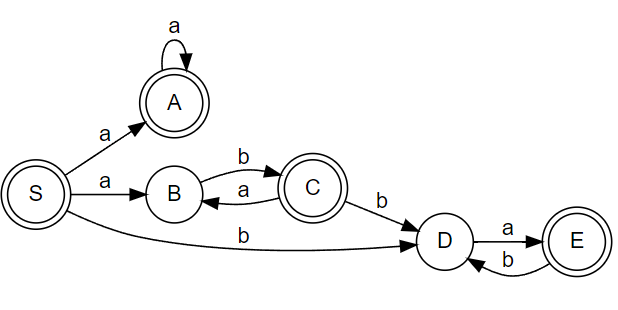
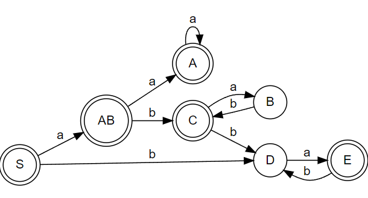

# 1. Kanonische Ableitung und Reduktion

## a)

Rechtskanonisch:


Linkskanonisch:


## b)

Rechtskanonisch:

`( ( v + v ) * v / v ) – ( v / *v* )` =>

~~`( ( v + v ) * v / v ) – ( v / *F* )` =>~~

~~`( ( v + v ) * v / v ) – ( F / T )` =>~~ 

`( ( v + v ) * v / v ) – ( *v* / F )` =>

`( ( v + v ) * v / v ) – ( *F* / F )` =>

`( ( v + v ) * v / v ) – ( *T / F* )` =>

`( ( v + v ) * v / v ) – ( *T* )` =>

`( ( v + v ) * v / v ) – *( E )*` =>

`( ( v + v ) * v / v ) – *F*` =>

`( ( v + v ) * v / *v* ) – T` =>

`( ( v + v ) * *v* / F ) – T` =>

`( ( v + *v* ) * F / F ) – T` =>

`( ( v + *F* ) * F / F ) – T` =>

`( ( *v* + T ) * F / F ) – T` =>

`( ( *F* + T ) * F / F ) – T` =>

`( ( *T* + T ) * F / F ) – T` =>

`( ( *E + T* ) * F / F ) – T` =>

`( *( E )* * F / F ) – T` =>

`( *F* * F / F ) – T` =>

`( *T * F* / F ) – T` =>

`( *T / F* ) – T` =>

`( *T* ) – T` =>

`*( E )* – T` =>

`*F* – T` =>

`*T* – T` =>

`*E – T*` =>

`E`

Syntaxbaum:


Linkskanonisch:

`( ( *v* + v ) * v / v ) – ( v / v )` =>

`( ( *F* + v ) * v / v ) – ( v / v )` =>

`( ( *T* + v ) * v / v ) – ( v / v )` =>

`( ( E + *v* ) * v / v ) – ( v / v )` =>

`( ( E + *F* ) * v / v ) – ( v / v )` =>

`( ( *E + T* ) * v / v ) – ( v / v )` =>

`( *( E )* * v / v ) – ( v / v )` =>

`( *F* * v / v ) – ( v / v )` =>

`( T * *v* / v ) – ( v / v )` =>

`( *T * F* / v ) – ( v / v )` =>

`( T / *v* ) – ( v / v )` =>

`( *T / F* ) – ( v / v )` =>

`( *T* ) – ( v / v )` =>

`*( E )* – ( v / v )` =>

`*F* – ( v / v )` =>

`*T* – ( v / v )` =>

`E – ( *v* / v )` =>

`E – ( *F* / v )` =>

`E – ( T / *v* )` =>

`E – ( *T / F* )` =>

`E – ( *T* )` =>

`E – *( E )*` =>

`E – *F*` =>

`*E – T*` =>

`E`


Die Anzahl der Reduktionen ist bei beiden Varianten gleihc (25 Ableitungen).

# 2. Mehrdeutigkeit, Beschreibung und Schreibweisen

## a)

Bei `frac` ist die Mehrdeutig, da man auf `n` kommen kann, indem man entweder die 1. Alternative verwendet, oder die 2. Alternative und dann `frac` durch `ε`.

Beispiel: `6.9`

`real` => `mant` => `sign int . frac` => `ε int . frac` => `ε n . frac` 

| option 1     | option 2          |
| ------------ | ----------------- |
| => `ε n . n` | => `ε n . frac n` |
| => `ε 6 . n` | => `ε 6 . frac n` |
| => `ε 6 . 9` | => `ε 6 . ε n`    | 
|              | => `ε 6 . 9`      | 

Änderung: `frac -> n | frac n | ε ` auf `frac -> frac n | ε `, rest bleibt gleich.

## b) Äquivalänte, eindeutige Grammatik

Möglichst wenige Regeln:

`G(real):`

`real = ['+'|'-'] (0|...|9) {0|...|9} ['.' {0|...|9} ] ['E' ['+'|'-'] (0|...|9) {0|...|9}] .`

"Kürzer":

`real = optSign n {n} ['.' {n} ] ['E' optSign n {n}] .`

`optSign = ['+'|'-'] .`

`n = 0 | 1 | 2 | 3 | 4 | 5 | 6 | 7 | 8 | 9 .`

# 3. Reguläre Grammatiken

## a)

Sätze:

ε

ab

abababababab(ab)...

bb

bbbbbbb(b)...

`S -> A b | B b | ε .`
`A -> a | C a .`
`C -> A b .`
`B -> b | B b .`

## b)

`ab(ab)∗ + b(b)* + ε` oder besser `(ab)* + (b)*` (erspaart das `ε`)


# 4. Bezeichner in der Programmiersprache Ada

## a)

`B -> l | l R`

`R -> d | l | '_' U | l R | d R`

`U -> l | d | l R | d R`

## b)

`B -> l | R l | R d`

`R -> U '_' | R l | R d | l`

`U -> R d | R l | l`

## c)

`l ( l + d + '_' l + '_' d)*`

Unix:

`l(l|d|_l|_d)*` =^= `l(_?(l|d))*` =^= `l(_?[ld])*`

# 5. Transformation zwischen Darstellungsformen regulärer Sprachen

## a)

```
digraph non_deteministic_finite_state_machine {
	fontname="Helvetica,Arial,sans-serif"
	node [fontname="Helvetica,Arial,sans-serif"]
	edge [fontname="Helvetica,Arial,sans-serif"]
	rankdir=LR;
	node [shape = doublecircle]; S A C E;
	node [shape = circle];
	
	S -> A [label = "a"]
	A -> A [label = "a"]
	S -> B [label = "a"]
	B -> C [label = "b"]
	S -> D [label = "b"]
	C -> D [label = "b"]
	C -> B [label = "a"]
	D -> E [label = "a"]
	E -> D [label = "b"]
	
}
```



|             | 0           | 1           |
| ----------- | ----------- | ----------- |
| -> S        | {A, B}      | {D}         |
| o A         | {A}         | -           |
| B           | {C}         | -           |
| o C         | {B}         | {D}         |
| D           | {E}         | -           |
| o E         | -           | {D}         |
|             |             |             |
| o {A, B}    | {A}         | {C}         |

```
digraph deteministic_finite_state_machine {
	fontname="Helvetica,Arial,sans-serif"
	node [fontname="Helvetica,Arial,sans-serif"]
	edge [fontname="Helvetica,Arial,sans-serif"]
	rankdir=LR;
	node [shape = doublecircle]; S A C E AB;
	node [shape = circle];
	
	S -> AB [label = "a"]
	AB -> A [label = "a"]
	AB -> C [label = "b"]
	A -> A [label = "a"]
	B -> C [label = "b"]
	S -> D [label = "b"]
	C -> D [label = "b"]
	C -> B [label = "a"]
	D -> E [label = "a"]
	E -> D [label = "b"]
	
}
```



## b)

0 anhängen => *2
1 anhängen => *2 + 1


