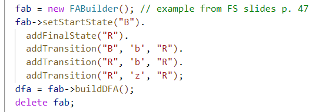

# 1. Objektorientierte Implementierung endlicher Automaten

# 2. DFA, Erkennung und Mealy- oder Moore-Automat

## a)

Code:

Tests:

## b)

# 3. NFA, Transformation NFA -> DFA und Zustandsminimierung 

# 4. Kellerautomat und erweiterter Kellerautomat

für jede regel übeführung machen (in VO unterlagen nachsehen)
Arguments: Zustand NT vom stack (liest aber nix vom band) => legt alpha uaf stack in umgekehrter reihenfolge

d(Z, e, Declaration) = (Z, VarDeclList VAR) => VarDeclList erstellen
d(Z, e, VarDecl) = (Z, Type ":" IdentList)
...

d(Z, e, TypeIdent) = (Z, INTEGER)
d(Z, e, TypeIdent) = (Z, BOOLEAN)
d(Z, e, TypeIdent) = (Z, CHAR)
d(Z, INTEGER, INTEGER) = (Z, e) => reduktion
(Z, VAR, VAR) = (Z, e)

(Z, Declaration .VAR a, b: INTEGER;)
(Z, VarDeclList **VAR** . VARa, b: INTEGER;)
(Z, VarDeclList . a, b: INTEGER;)

# 5. Term. Anfänge/Nachfolger, LL(k)-Bedingung u. Transformation

