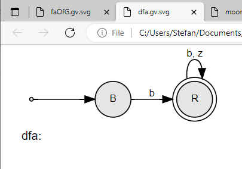

# 1. Objektorientierte Implementierung endlicher Automaten

### Lösungsideen:

Anmerkung: beim Durchlaufen von allen meinen Lösungen gab es laut report 0 Speicherleichen (kein Bild, um Seite zu sparen)

#### faOf():

Beim Durchdenken des Algorithmus habe ich festgestellt, dass Epsilon-Alternativen in der reguläre Grammatik die Umsetzung erschweren könnten.
Deshalb wird zunächst die reguläre Grammatik mit der Methode **newEpsilonFreeGrammarOf** aus dem ersten Übungszettel Epsilon-frei gemacht.
Man kann dann die reguläre Grammatik relativ einfach in einen endlichen Automaten umwandeln, indem man jede Alternative einer Regel (z.B. **S -> a B**) in einen Zustandsübergang vom NTSymbol der Regel (**S**) auf den Zustand (NTSymbol an zweiter Stelle in der Alternative **B**) mit dem Band-Symbol (TSymbol an erster Stelle in der Alternative **a**) umwandelt.
Alle Alternativen, die nur aus einem TSymbol bestehen, bekommen einen Zustandsübergang auf einen allgemeinen End-Zustand (**END**).
Da die reguläre Grammatik Epsilon-frei ist, gibt es höchstens ein Epsilon, welches sich im Satz-Symbol befinden könnte.
In diesem Fall wird der Zustand für das Satz-Symbol auch als End-Zustand markiert.

#### grammarOf():

Es kann ein beliebiger **FA** übergeben werden.
Damit ich DFA und NFA bei der Implemtierung des Algorithmus gleich behandeln kann, habe ich die Sichtbarkeit der Methode **virtual StateSet FA::deltaAt(const State &src, TapeSymbol tSy) const = 0;** auf public geändert und immer mit **StateSet**s gearbeitet.

Es werden alle Kombinationen von Zuständen und Band-Symbolen auf die Zustandsüberführungsfunktion angewandt (verschachtelte Schleife).
Um nicht zwischen DFA und NFA unterscheiden zu müssen, wurde die Sichtbarkeit von der Methode **deltaOf() der Klasse FA** von **protected** auf **public** geändert und immer mit **StateSet**s gearbeitet.
Bei jeder Anwendung der Zustandsüberführungsfunktion ist der **State** (Variable in der Schleife) die Regel der Grammatik.
Das Band-Symbol (Variable in der Schleife => TSymbol) und die von **deltaOf()** gelieferten Zustände (NTSymbol) bilden Sequenzen dieser Regel.
Falls die **deltaOf()** von gelieferten Zustände keine ausgehenden Zustandsüberführungen mehr haben, dann werden diese in der Grammatik einfach ignoriert und das Band-Symbol hat in der Alternative kein nachfolgendes NTSymbol.
Falls der Start-Zustand bereits ein End-Zustand ist, bekommt die Regel dieses Zustandes eine Epsilon-Alternative.

### Code:

```cpp
FA *faOf(const Grammar *g) 
{
  bool deleteG = false;
  FABuilder fab{};
  const Grammar* gToUse = g;
  // ensure g is epsilon-free
  if (!g->isEpsilonFree()) {
    deleteG = true;
    gToUse = newEpsilonFreeGrammarOf(g);
  }

  // set final states
  if (deleteG) { // means that g has S' => is end state
    fab.addFinalState(g->root->name);
  } else {
    // if rule of root already contained epsilon,
    // mark it as end state
    for (auto rootAlternatives : g->rules[g->root]) {
      if (rootAlternatives->size() == 0)
        fab.addFinalState(g->root->name);
    }
  }

  fab.setStartState(g->root->name);
  // generic end state "END" for alternatives without NT
  fab.addFinalState("END");

  for (auto [ntSy, alternatives] : g->rules) {
    for (auto alternative : alternatives) {
      
      if (alternative->size() > 0) { // ignore eps alternatives
        char ts = alternative->at(0)->name[0];
        if (alternative->size() == 1) { 
          // no ntSy in alternative => 
          // ntSy has edge to artificial end state with ts
          fab.addTransition(ntSy->name, ts, "END");
        } else if (alternative->size() == 2) {
          // ntSy has edge to nextState with ts
          string nextState = alternative->at(1)->name;
          fab.addTransition(ntSy->name, ts, nextState);
        }
      }      
    }
  }

  // delete generated epsilon-free grammar
  if (deleteG) delete g;

  return fab.buildNFA();
}

Grammar* grammarOf(const FA* fa) {

  SymbolPool sp{};
  GrammarBuilder gb{sp.ntSymbol(fa->s1)};

  // iterate over each state
  for (const State& state : fa->S) {
    // iterate over each tape symbol
    for (const TapeSymbol& ts : fa->V) {
      // get all possible transition destinatons from state using tape symbol
      auto destinations = fa->deltaAt(state, ts);
      for (const State& dest : destinations) {
        // add this transition to grammar as alternative

        // takes care of states like S' or END
        // if dest does not have any outgoing tape symbols
        // => ignore dest in grammar
        bool hasOutgoing = false;
        for (const TapeSymbol& ts1 : fa->V) {
          if (fa->deltaAt(dest, ts1).size() > 0) {
            hasOutgoing = true;
          }
        }

        if (hasOutgoing) {
          gb.addRule(sp.ntSymbol(state), 
            new Sequence({
              sp.tSymbol(string{ts}), 
              sp.ntSymbol(dest)}
              )
          );
        } else {
          gb.addRule(sp.ntSymbol(state), 
            new Sequence({sp.tSymbol(string{ts})})
          );
        }         

        // if dest is an end state, also add alternative without dest
        if (fa->F.contains(dest)) {
          gb.addRule(sp.ntSymbol(state), 
            new Sequence(sp.tSymbol(string{ts}))
          );
        }
      }
    }
  }

  // if start state is also end state, add epsilon as alternative
  if (fa->F.contains(fa->s1)) {
    gb.addRule(sp.ntSymbol(fa->s1), new Sequence());
  }

  return gb.buildGrammar();
}
```


### Tests:

```cpp
  cout << "1.a) faOf" << endl;
  cout << "------" << endl;
  cout << endl;
  
  GrammarBuilder gb{string("G.txt")};

  Grammar* g = gb.buildGrammar();
  FA* faOfG = faOf(g);
  vizualizeFA("faOfG", faOfG);

  cout << "1.b) grammarOf" << endl;
  cout << "------" << endl;
  cout << endl;

  Grammar* gOfFaOfG = grammarOf(faOfG);
  std::cout << *gOfFaOfG;

  delete g;
  delete faOfG;
  delete gOfFaOfG;
```

### Testfall 1

```
G(B):
B -> b | b R
R -> b | z | b R | z R
```


**gOfFaOfG** und Eingabe-Grammatik sind wieder gleich.

### Testfall 2

```
G(K):
K -> z | z R | + R | - R
R -> z | z R
```


**gOfFaOfG** und Eingabe-Grammatik sind wieder gleich.

### Testfall 3 - Grammatik mit Epsilon (vom Übungszettel 2 geklaut)

Anmerkung: Die Grammatik ist bereits Epsilon-Frei.
Bei dem Test geht es nur darum, zu sehen, ob der Zustand für das Satz-Symbol (Start-Zustand) auch als End-Zustand markiert wird.

```
G(S):
S -> b A | a B | eps
A -> b A | b
B -> b C | b
C -> a B
```


**gOfFaOfG** und Eingabe-Grammatik sind wieder gleich, Start-Zustand auch als End-Zustand markiert.

# 2. DFA, Erkennung und Mealy- oder Moore-Automat

## a)

Code:

```cpp
  cout << "2.a) DFA" << endl;
  cout << "------" << endl;
  cout << endl;

  fab = new FABuilder();
  fab->setStartState("B").
    addFinalState("R").
    addTransition("B", 'b', "R").
    addTransition("R", 'b', "R").
    addTransition("R", 'z', "R");

  dfa = fab->buildDFA();
  vizualizeFA("dfa", dfa);

  cout << "dfa->accepts(\"bzb\") = " << boolalpha << dfa->accepts("bzb") << endl;
  cout << "dfa->accepts(\"bbbbzbzz\") = " << boolalpha << dfa->accepts("bbbbzbzz") << endl;
  cout << "dfa->accepts(\"zbb\")   = " << boolalpha << dfa->accepts("z")  << endl;
  cout << endl;

  delete dfa;
  delete fab;
```




### Tests:

## b)

Eigentlich benötigt der MooreDFA nur eine Map, in der definiert ist, bei welchem State durch welches Symbol ausgegeben wird.
Diese Map muss dann beim Erkennen des Band-Inhaltes verwendet werden (hier geben wir den Wert für den State einfach auf der Konsole aus).

### Code:

```cpp
// MooreDFA.h:                                                 SWE, 2022
// -----
// Objects of class MooreDFA represent deterministic finite automata.
//======================================================================

#ifndef MooreDFA_h
#define MooreDFA_h

#include "ObjectCounter.h"
#include "TapeStuff.h"
#include "StateStuff.h"
#include "DFA.h"


class FABuilder; 

class MooreDFA: public DFA
 /*OC+*/ , private ObjectCounter<MooreDFA> /*+OC*/ {

  friend class FABuilder;
  private:
    typedef DFA Base;

  protected: // allows derived classes, e.g., for Mealy and or Moore
    // constructor called by FABuilder::build... methods and derived classes
    MooreDFA(const StateSet &S,  const TapeSymbolSet &V,
        const State    &s1, const StateSet      &F,
        const DDelta   &delta, 
        const std::map<State, char> &mooreLambda);

  public:
    const std::map<State, char> mooreLambda;
    MooreDFA(const MooreDFA  &mooredfa) = default;
    MooreDFA(      MooreDFA &&mooredfa) = default;

    virtual ~MooreDFA() = default;
    virtual bool accepts(const Tape &tape) const;

}; // DFA

#endif

// end of MooreDFA.h
//======================================================================

// MooreDFA.cpp:                                                SWE, 2022
// -------
// Objects of class MooreDFA represent deterministic finite automata.
//======================================================================

#include <cmath>
#include <cstring>

#include <iostream>
#include <fstream>
#include <map>
#include <sstream>

using namespace std;

#include "TapeStuff.h"
#include "StateStuff.h"
#include "MbMatrix.h"
#include "FABuilder.h"
#include "MooreDFA.h"

// --- implementation of class MooreDFA ---

MooreDFA::MooreDFA(const StateSet &S,  const TapeSymbolSet &V,
         const State    &s1, const StateSet      &F,
         const DDelta   &delta,
         const std::map<State, char> &mooreLambda)
: DFA(S, V, s1, F, delta), mooreLambda(mooreLambda) {
} // MooreDFA::MooreDFA

bool MooreDFA::accepts(const Tape &tape) const {
  int        i   = 0;       // index of first symbol
  TapeSymbol tSy = tape[i]; // fetch first tape symbol
  State      s   = s1;      // start state
  cout << mooreLambda.at(s);
  while (tSy != eot) {      // eot = end of tape
    s = delta[s][tSy];
    if (!defined(s))
      return false;         // s undefined, so no acceptance
    cout << mooreLambda.at(s);
    i++;
    tSy = tape[i];          // fetch next symbol
  } // while
  cout << " ";
  return F.contains(s);     // accepted <==> s element of F
} // MooreDFA::accepts

// end of MooreDFA.cpp
//======================================================================
```

### Tests:

```cpp
  cout << "2.b) MooreDFA" << endl;
  cout << "------" << endl;
  cout << endl;

  fab = new FABuilder();
  fab->setStartState("S").
    addFinalState("B").
    addFinalState("Z").
    addTransition("S", 'b', "B").
    addTransition("B", 'b', "B").
    addTransition("B", 'z', "Z").
    addTransition("Z", 'z', "Z").
    addTransition("Z", 'b', "B").
    setSetMooreLambda({
      {"S", ' '},
      {"B", 'c'}, 
      {"Z", 'd'}
    });

  MooreDFA* mooreDfa = fab->buildMooreDFA();

  cout << "mooreDfa->accepts(\"bzb\") = " << boolalpha << mooreDfa->accepts("bzb") << endl;
  cout << "mooreDfa->accepts(\"bbbbzbzz\") = " << boolalpha << mooreDfa->accepts("bbbbzbzz") << endl;
  cout << "mooreDfa->accepts(\"zbb\")   = " << boolalpha << mooreDfa->accepts("z")  << endl;
  cout << endl;

  vizualizeFA("mooreDfa", mooreDfa);
  
  delete mooreDfa;
  delete fab;
```


# 3. NFA, Transformation NFA -> DFA und Zustandsminimierung 

## a)

### Code:

```cpp
  cout << "3.a)" << endl;
  cout << "------" << endl;
  cout << endl;

  fab = new FABuilder();
  fab->setStartState("S").
    addFinalState("R").
    addTransition("S", 'a', "S").
    addTransition("S", 'b', "S").
    addTransition("S", 'c', "S").
    addTransition("S", 'a', "A").
    addTransition("S", 'b', "B").
    addTransition("S", 'c', "C").
    addTransition("A", 'a', "A").
    addTransition("A", 'b', "A").
    addTransition("A", 'c', "A").
    addTransition("B", 'a', "B").
    addTransition("B", 'b', "B").
    addTransition("B", 'c', "B").
    addTransition("C", 'a', "C").
    addTransition("C", 'b', "C").
    addTransition("C", 'c', "C").
    addTransition("A", 'a', "R").
    addTransition("B", 'b', "R").
    addTransition("C", 'c', "R");

  NFA* abc = fab->buildNFA();
  cout << "abc->accepts1(\"cabcabcabcabcc\") = " << abc->accepts1("cabcabcabcabcc") << endl;
  cout << "abc->accepts2(\"cabcabcabcabcc\") = " << abc->accepts2("cabcabcabcabcc") << endl;
  cout << "abc->accepts3(\"cabcabcabcabcc\") = " << abc->accepts3("cabcabcabcabcc") << endl;

  cout << "abc->accepts1(\"caaaaaaaaaaaaaaad\") = " << abc->accepts1("caaaaaaaaaaaaaaad") << endl;
  cout << "abc->accepts2(\"caaaaaaaaaaaaaaad\") = " << abc->accepts2("caaaaaaaaaaaaaaad") << endl;
  cout << "abc->accepts3(\"caaaaaaaaaaaaaaad\") = " << abc->accepts3("caaaaaaaaaaaaaaad") << endl;

  delete abc;
  delete fab;
```
### Tests:


## b)

### Code:

```cpp
  void TimeAccept(NFA* abc, void (*func)(NFA* abc)) {
    stopwatch::Stopwatch sw{}; // implemented by myself
    sw.start();
    func(abc);
    cout << "Elapsed time: " << sw.elapsed<TimeFormat::MICROSECONDS>() << " micro sec" << endl;
  }

// ... same as 3a)

  TimeAccept(abc, [](NFA* abc) {
    cout << "abc->accepts1(\"cabcabcabcabcc\") = " << abc->accepts1("cabcabcabcabcc") << endl;
  });
  TimeAccept(abc, [](NFA* abc) {
    cout << "abc->accepts2(\"cabcabcabcabcc\") = " << abc->accepts2("cabcabcabcabcc") << endl;
  });
  TimeAccept(abc, [](NFA* abc) {
    cout << "abc->accepts3(\"cabcabcabcabcc\") = " << abc->accepts3("cabcabcabcabcc") << endl;
  });
  
  TimeAccept(abc, [](NFA* abc) {
    cout << "abc->accepts1(\"caaaaaaaaaaaaaaad\") = " << abc->accepts1("caaaaaaaaaaaaaaad") << endl;
  });
  TimeAccept(abc, [](NFA* abc) {
    cout << "abc->accepts2(\"caaaaaaaaaaaaaaad\") = " << abc->accepts2("caaaaaaaaaaaaaaad") << endl;
  });
  TimeAccept(abc, [](NFA* abc) {
    cout << "abc->accepts3(\"caaaaaaaaaaaaaaad\") = " << abc->accepts3("caaaaaaaaaaaaaaad") << endl;
  });

// ... same as 3a)

```


## c)

### Code:

```cpp
// ... same as 3a)

  DFA* abcDfa = abc->dfaOf();
  vizualizeFA("abcDfa", abcDfa);
  delete abcDfa;

// ... same as 3a)
```


## d)

### Code:

```cpp
// ... same as 3a)

  abcDfa = abc->dfaOf();
  DFA* abcDfaMinimal = abcDfa->minimalOf();

  vizualizeFA("abcDfa", abcDfa);  
  vizualizeFA("abcDfaMinimal", abcDfaMinimal);  

  delete abcDfaMinimal;
  delete abcDfa;

// ... same as 3a)
```


**abcDfa** war bereits minimal, da sich **abcDfa** nach der Minimierung nicht verändert hat.

# 4. Kellerautomat und erweiterter Kellerautomat

## a)

```
Declaration     -> VAR | VAR VarDeclList .
VarDeclList     -> VarDecl ";" | VarDecl ";" VarDeclList .
VarDecl         -> IdentList ":" Type .
IdentList       -> ident | ident "," IdentList .
Type            -> ARRAY "(" number ")" OF TypeIdent | TypeIdent .
TypeIdent       -> INTEGER | BOOLEAN | CHAR .
```

## b)

```
S1:
d(Z, ε, Declaration)    = (Z, VAR)
d(Z, ε, Declaration)    = (Z, VarDeclList VAR)
d(Z, ε, VarDeclList)    = (Z, ";" VarDecl)
d(Z, ε, VarDeclList)    = (Z, VarDeclList ";" VarDecl)
d(Z, ε, VarDecl)        = (Z, Type ":" IdentList)
d(Z, ε, IdentList)      = (Z, ident)
d(Z, ε, IdentList)      = (Z, IdentList "," ident)
d(Z, ε, Type)           = (Z, TypeIdent OF ")" number "(" ARRAY)
d(Z, ε, Type)           = (Z, TypeIdent)
d(Z, ε, TypeIdent)      = (Z, INTEGER)
d(Z, ε, TypeIdent)      = (Z, BOOLEAN)
d(Z, ε, TypeIdent)      = (Z, CHAR)

S2:
d(Z, VAR, VAR)          = (Z, ε)
d(Z, ";", ";")          = (Z, ε)
d(Z, ident, ident)      = (Z, ε)
d(Z, ":", ":")          = (Z, ε)
d(Z, ",", ",")          = (Z, ε)
d(Z, ARRAY, ARRAY)      = (Z, ε)
d(Z, number, number)    = (Z, ε)
d(Z, OF, OF)            = (Z, ε)
d(Z, ")", ")")          = (Z, ε)
d(Z, "(", "(")          = (Z, ε)
d(Z, INTEGER, INTEGER)  = (Z, ε)
d(Z, BOOLEAN, BOOLEAN)  = (Z, ε)
d(Z, CHAR, CHAR)        = (Z, ε)
```

## c)

```
S1:
d(Z, ε, VAR)                                = (Z, Declaration)
d(Z, ε, VAR VarDeclList)                    = (Z, Declaration)
d(Z, ε, VarDecl ";")                        = (Z, VarDeclList)
d(Z, ε, VarDecl ";" VarDeclList)            = (Z, VarDeclList)
d(Z, ε, IdentList ":" Type)                 = (Z, VarDecl)
d(Z, ε, ident)                              = (Z, IdentList)
d(Z, ε, ident "," IdentList)                = (Z, IdentList)
d(Z, ε, ARRAY "(" number ")" OF TypeIdent)  = (Z, Type)
d(Z, ε, TypeIdent)                          = (Z, Type)
d(Z, ε, INTEGER)                            = (Z, TypeIdent)
d(Z, ε, BOOLEAN)                            = (Z, TypeIdent)
d(Z, ε, CHAR)                               = (Z, TypeIdent)

S2:
d(Z, VAR, $)            = (Z, $ VAR)
d(Z, ";", $)            = (Z, $ ";")
d(Z, ident, $)          = (Z, $ ident)
d(Z, ":", $)            = (Z, $ ":")
d(Z, ",", $)            = (Z, $ ",")
d(Z, ARRAY, $)          = (Z, $ ARRAY)
d(Z, number, $)         = (Z, $ number)
d(Z, OF, $)             = (Z, $ OF)
d(Z, ")", $)            = (Z, $ ")")
d(Z, "(", $)            = (Z, $ "(")
d(Z, INTEGER, $)        = (Z, $ INTEGER)
d(Z, BOOLEAN, $)        = (Z, $ BOOLEAN)
d(Z, CHAR, $)           = (Z, $ CHAR)
d(Z, CHAR, Declaration) = (Z, Declaration CHAR)
... 13*7 - 1 more (alle weiteren Kombinationen mit TSymbol + NTSymbol)

S3:
S(Z, ε, $Declaration) = (R, ε)
```

<div style="page-break-after: always; visibility: hidden"> 
\pagebreak 
</div>

## d)

### für b) (nur erfolgreiche Züge)

```
(Z, Declaration                 .VAR a, b: INTEGER;) |-- 
(Z, VarDeclList VAR             .VAR a, b: INTEGER;) |-- 
(Z, VarDeclList                 .a, b: INTEGER;) |-- 
(Z, ; VarDecl                   .a, b: INTEGER;) |-- 
(Z, ; Type : IdentList          .a, b: INTEGER;) |-- 
(Z, ; Type : IdentList , ident  .a, b: INTEGER;) |-- 
(Z, ; Type : IdentList ,        ., b: INTEGER;) |-- 
(Z, ; Type : IdentList          .b: INTEGER;) |-- 
(Z, ; Type : ident              .b: INTEGER;) |-- 
(Z, ; Type :                    .: INTEGER;) |-- 
(Z, ; Type                      .INTEGER;) |-- 
(Z, ; TypeIdent                 .INTEGER;) |-- 
(Z, ;                           .;) |-- 
(Z,                             .) erkannt! (Keller leer)
```

### für c) (nur erfolgreiche Züge)

```
(Z, $                           .VAR a, b: INTEGER;) |--
(Z, $VAR                        .a, b: INTEGER;) |--
(Z, $VAR a                      ., b: INTEGER;) |--
(Z, $VAR ident                  ., b: INTEGER;) |--
(Z, $VAR ident,                 . b: INTEGER;) |--
(Z, $VAR ident, b               .: INTEGER;) |--
(Z, $VAR ident, ident           .: INTEGER;) |--
(Z, $VAR ident, IdentList       .: INTEGER;) |--
(Z, $VAR IdentList              .: INTEGER;) |--
(Z, $VAR IdentList :            .INTEGER;) |--
(Z, $VAR IdentList : INTEGER    .;) |--
(Z, $VAR IdentList : Type       .;) |--
(Z, $VAR VarDecl                .;) |--
(Z, $VAR VarDecl ;              .) |--
(Z, $VAR VarDeclList            .) |--
(Z, $Declaration                .) |--
(R,                             .) erkannt!
```

# 5. Term. Anfänge/Nachfolger, LL(k)-Bedingung u. Transformation

## a)

```
// prodmod
First1(MODULE id : priority ; imppart block id .) = { MODULE }
// priority
First1(const)                   = { const }
First1(ε)                       = { ";" } 
    => Follow1(priority)
// imppart
First1(FROM id IMPORT implist)  = { FROM }
First1(IMPORT implist)          = { IMPORT }
// implist                
First1(id)                      = { id } // bad
First1(id, implist)             = { id } // bad
// block
First1(dclpart statpart)        = { DECL } 
    dclpart => DECL
First1(statpart)                = { BEGIN } 
    statpart => BEGIN
// dclpart
First1(DECL)                    = { DECL } // bad
First1(DECL ; dclpart)          = { DECL } // bad
// statpart
First1(BEGIN statseq ; END)     = { BEGIN }
// statseq
First1(STAT)                    = { STAT } // bad
First1(STAT ; statseq)          = { STAT } // bad

// Follow1 ist für LL(1) eigentlich eh egal
Follow1(progmod)    = { } // root
Follow1(priority)   = { ";" };
Follow1(imppart)    = { DECL, BEGIN }; 
    imppart => block => declpart,statpart => DECL,BEGIN
Follow1(implist)    = { DECL, BEGIN }; 
    implist => imppart => block => declpart,statpart => DECL,BEGIN
Follow1(block)      = { id };
Follow1(dclpart)    = { BEGIN }; 
    dclpart => block => statpart => BEGIN
Follow1(statpart)   = { id }; 
    statpart => block
Follow1(statseq)    = { ";" };
```

## b)

Die Grammatik ist nicht LL(0), weil es bei einigen NTSymbolen mehr als eine Alternative gibt.

Die Grammatik kann auf jeden Fall nicht LL(1) sein, da beide Alternativen von **implist**, **dclpart** und **statseq** mit dem gleichen TSymbol beginnen.

```
Follow1(implist) = { DECL, BEGIN }; // könnte man eigentlich ja ignorieren
First1(id Follow1(implist)) = { id }
First1(id , implist Follow1(implist)) = { id }
{ id } ∩ { id } = { id } != { }
```

Die Grammatik ist nicht stark LL(2), da man bei **statseq** immernoch das Problem hat, dass das zweite Vorgriffszeichen der Alternativen (";") entweder von der zweiten Alternativen kommen kann, oder vom **statpart**.

```
Follow2(statseq) = { ";" END };
First2(STAT Follow2(statseq)) = { STAT ";" }
First2(STAT ; statseq Follow2(statseq)) = { STAT ";" }
{ STAT ";" } ∩ { STAT ";" } = { STAT ";" } != { }
```

Sie ist auch nicht schwach LL(2), da **statpart** (Regel, die **statseq** verwendet) nur aus einer Alternative besteht und die 2 Vorgriffs-Symbole nicht ausreichen, um hier eine Entscheidungsfindung zu machen.

Erkennung in einer Satzform:
```
... BEGIN statseq ";" END
    => ... BEGIN _STAT ";"_ END
    oder
    => ... BEGIN _STAT ";"_ STAT ";" END
```

Mit einem dritten Vorgriffssymbol kann dieses Problem gelöst werden und die Grammatik ist stark LL(3):

```
Follow2(statseq) = { ";" END };
First2(STAT Follow2(statseq)) = { STAT ";" END }
First2(STAT ; STAT ; Follow2(statseq)) = { STAT ";" STAT }
{ STAT ";" END } ∩ { STAT ";" STAT } = { }
```

Erkennung in einer Satzform:
```
... BEGIN statseq ";" END
    => ... BEGIN _STAT ";" END_
    oder
    => ... BEGIN _STAT ";" STAT_ ";" END
```

## c)

Regeln, die bereits die LL(1)-Bedingung verletzten abändern (**implist**, **dclpart** und **statseq**).

```
progmod         -> MODULE id : priority ; imppart block id . .
priority        -> const | ε .
imppart         -> FROM id IMPORT implist | IMPORT implist .
implist         -> id implist_list .
implist_list    -> , id implist_list | ε .
block           -> dclpart statpart | statpart .
dclpart         -> DECL dclpart_list .
dclpart_list    -> ; DECL dclpart_list | ε .
statpart        -> BEGIN statseq ; END .
statseq         -> STAT statseq_list .
statseq_list    -> ; STAT statseq_list | ε .

```

Nach Transformation nun prüfen, ob LL(1) Bedingung erfüllt ist.
Am einfachsten kann man das machen, indem man die First1() von allen Alternativen auslistet und prüft, dass jedes Vorgriffssymbol einer Alternative pro Regel maximal 1x vorkommt. Falls die Alternative von Regel **R** nur aus **ε** besteht, muss wieder Follow1(**R**) genommen werden.

```
// prodmod
First1(MODULE id : priority ; imppart block id .) = { MODULE }
// priority
First1(const)                   = { const }
First1(ε)                       = { "," } 
    => Follow1(priority)
// imppart
First1(FROM id IMPORT implist)  = { FROM }
First1(IMPORT implist)          = { IMPORT }
// implist                
First1(id implist_list          = { id }
// implist_list
First1(, id implist_list)       = { "," }
First1(ε)                       = { DECL, BEGIN } 
    => Follow1(implist_list) => implist => imppart => block => declpart,statpart => DECL,BEGIN
// block
First1(dclpart statpart)        = { DECL } 
    dclpart => DECL
First1(statpart)                = { BEGIN } 
    statpart => BEGIN
// dclpart
First1(DECL dclpart_list)       = { DECL }
// dclpart_list
First1(; DECL dclpart_list)     = { ";" }
First1(ε)                       = { BEGIN }
     => Follow1(dclpart_list) => declpart => statpart => BEGIN
// statpart
First1(BEGIN statseq ; END)     = { BEGIN }
// statseq
First1(STAT statseq_list)       = { STAT }
// statseq_list
First1(; STAT statseq_list)     = { ";" } // still bad
First1(ε)                       = { ";" } // still bad
     => Follow1(statseq_list) => statseq => ";"
```

Aufgrund  **statseq\_list** ist Grammatik immernoch nicht LL(1) => **statpart**, **statseq** und **statseq\_list** ändern.

Grammatik:

```
... everything above unchanged
statpart   -> BEGIN STAT ; statseq END .
statseq    -> STAT ; statseq | ε .
statseq_list removed
```

Follow1():

```
... everything above unchanged
// statpart
First1(BEGIN STAT ; statseq END)    = { BEGIN }
// statseq
First1(STAT ; statseq)              = { STAT }
First1(ε)                           = { END }
     => Follow1(statseq) => END
```

Grammatik ist nun LL(1).
