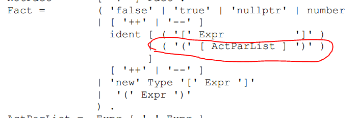
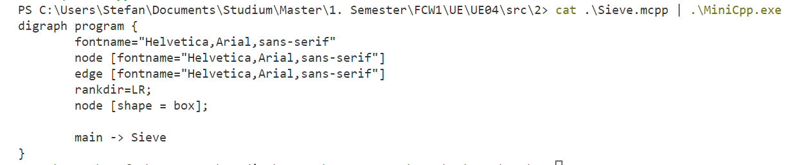
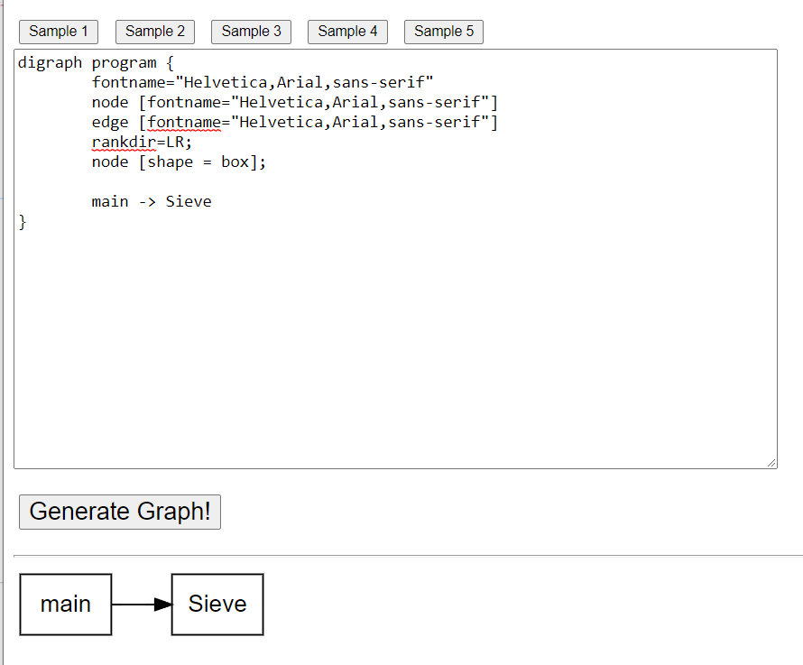
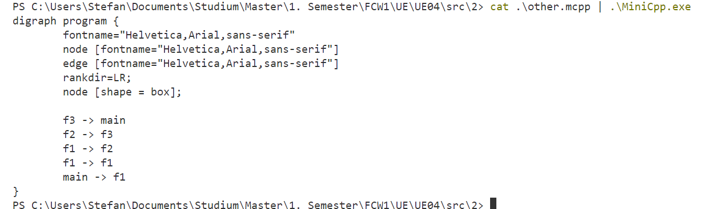
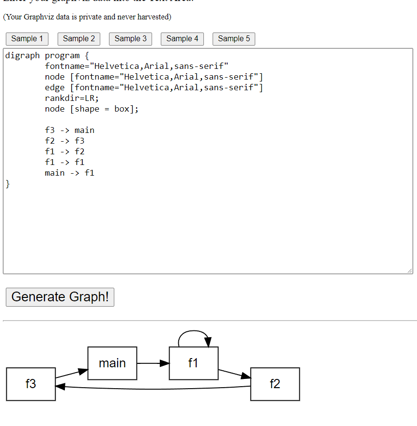

# 1. MiniC: Scanner und Parser mit (f)lex und yacc/bison

## MiniC.l

```c
/*MiniC.l:                                            
  ------
  Description of the lexical structure for MiniCw.
====================================================================*/

%{

  #include "MiniC.tab.h" /*generated by yacc/bison from MiniC.y
                          if option -d is used, defines NUMBER      */


%}

%%

[ \t\r\n]+   { ; }          /*ignore white space: blanks, tabs and new line       */

[0-9]+   { return NUMBER; }              

void                    { return VOID; }
main                    { return MAIN; }
int                     { return INT; }
scanf                   { return SCANF; }
printf                  { return PRINTF; }

[A-Za-z_][A-Za-z0-9\_]* { return IDENT; }

.                       { return yytext[0]; } /*return all other chars 
                                 as tokens: '+', '-', ...           */
%%

int yywrap() {
  return 1; /*on end of input: no further files to scan             */
} /*yywrap*/

/* End of MiniC.l
====================================================================*/
```

## MiniC.y

```c
/*MiniC.y:                                              
  ------
  Attributed grammar for MiniC.
====================================================================*/

%{
    #include <stdio.h>
%}

%token NUMBER
%token IDENT
%token VOID
%token MAIN
%token INT
%token SCANF
%token PRINTF

%%

MiniC: VOID MAIN '(' ')' '{' 
                    OptVarDecl 
                    StatSeq 
                    '}' 
  ;

OptVarDecl: /* eps */
  | VarDecl
  ;

VarDecl: INT IdList ';' 
  ;

IdList: IDENT
  | IdList ',' IDENT
  ;

StatSeq: Stat
  | StatSeq Stat
  ;

Stat: ';'
  | IDENT '=' Expr ';'
  | SCANF '(' IDENT ')' ';'
  | PRINTF '(' Expr ')' ';'
  ;

Expr: Term         
  | Expr '+' Term  
  | Expr '-' Term 
  ;

Term: Fact        
  | Term '*' Fact
  | Term '/' Fact 
  ;
  
Fact: IDENT 
  | NUMBER
  | '(' Expr ')'
  ;
 
%%
extern int yylineno;

int yyerror(char *msg) {
  printf("error: %s in line %d\n", msg, yylineno);
  return 0;
} /*yyerror*/

int main(int argc, char *argv[]) {
  yyparse();
  return 0;
} /*main*/


/* End of Calc.y
====================================================================*/
```

## Commands

```
..\Flex-2.5.37\flex.exe --yylineno MiniC.l
..\Bison-2.7\bison.exe -g -d MiniC.y
gcc lex.yy.c MiniC.tab.c -o MiniC.exe
MiniC.exe < SVP.mc
```

## Tests

### SVP.mc

Input:

```c
void main() {
  int a, b, cs;
  scanf(a);
  scanf(b);
  cs = (a * a) + (b * b);
  printf(cs);
}
```

Output:

```
PS C:\Users\Stefan\Documents\Studium\Master\1. Semester\FCW1\UE\UE04\src\1> cat .\svp.mc | .\MiniC.exe
<nothing> (no syntax error)

```

# 2. MiniCpp: Scanner und Parser mit (f)lex und yacc/bison UND …

## a)

### MiniCpp.l

```c
/*MiniCpp.l:                                            
  ------
  Description of the lexical structure for MiniCpp.
====================================================================*/

%{

  #include "MiniCpp.tab.h" /*generated by yacc/bison from MiniCpp.y
                          if option -d is used, defines NUMBER      */


%}

%x IN_COMMENT

%%

<INITIAL>{
"/*" BEGIN(IN_COMMENT);
}
<IN_COMMENT>{
"*/" BEGIN(INITIAL);
[^*\n]+ // eat comment in chunks
"*" // eat the lone star
\n yylineno++;
}

"//".*\n                { ; } /* ignore comments */
[ \t\r\n]+              { ; } /*ignore white space: blanks, tabs and new line */
[0-9]+                  { return NUMBER; }
const                   { return CONST; }
false                   { return FALSE; }
true                    { return TRUE; }
nullptr                 { return NULLPTR; }
void                    { return VOID; }
bool                    { return BOOL; }
int                     { return INT; }
if                      { return IF; }
else                    { return ELSE; }
while                   { return WHILE; }
break                   { return BREAK; }
cin                     { return CIN; }
cout                    { return COUT; }
endl                    { return ENDL; }
delete                  { return DELETE; }
return                  { return RETURN; }
new                     { return NEW; }
"&&"                    { return LOGICALAND; }
"||"                    { return LOGICALOR; }
"+="                    { return ADDASSIGN; }
"-="                    { return SUBTRACTASSIGN; }
"*="                    { return MULTIPLYASSIGN; }
"\\="                   { return DIVIDEASSIGN; }
"%="                    { return MODULOASSIGN; }
"++"                    { return OPINCREMENT; }
"--"                    { return OPDECREMENT; }
"<<"                    { return OPSHIFTLEFT; }
">>"                    { return OPSHIFTRIGHT; }
"=="                    { return OPEQUAL; }
"!="                    { return OPNOTEQUAL; }
"<"                     { return OPLESS; }
"<="                    { return OPLESSEQUAL; }
">"                     { return OPGREATER; }
">="                    { return OPGREATEREQUAL; }
[A-Za-z_][A-Za-z0-9\_]* { return IDENT; }
\"([^\\\"]|\\.)*\"      { return STRING; } /* https://stackoverflow.com/questions/2039795/regular-expression-for-a-string-literal-in-flex-lex */
.                       { return yytext[0]; } /*return all other chars 
                                 as tokens: '+', '-', ...           */
%%

int yywrap() {
  return 1; /*on end of input: no further files to scan             */
} /*yywrap*/

/* End of MiniCpp.l
====================================================================*/
```

### MiniCpp.y

```c
/*MiniCpp.y:                                              
  ------
  Attributed grammar for MiniCpp.
====================================================================*/

%{
    #include <stdio.h>
%}

%token NUMBER
%token STRING
%token IDENT
%token CONST
%token FALSE
%token TRUE
%token NULLPTR
%token VOID
%token BOOL
%token INT
%token IF
%token ELSE
%token WHILE
%token BREAK
%token CIN
%token COUT
%token ENDL
%token DELETE
%token RETURN
%token NEW

%token LOGICALAND
%token LOGICALOR
%token ADDASSIGN
%token SUBTRACTASSIGN
%token MULTIPLYASSIGN
%token DIVIDEASSIGN
%token MODULOASSIGN
%token OPINCREMENT
%token OPDECREMENT
%token OPSHIFTLEFT
%token OPSHIFTRIGHT
%token OPEQUAL
%token OPNOTEQUAL
%token OPLESS
%token OPLESSEQUAL
%token OPGREATER
%token OPGREATEREQUAL

%%

MiniCpp: MiniCppList
  ;

MiniCppList: /* eps */
  | MiniCppList ConstDef 
  | MiniCppList VarDef
  | MiniCppList FuncDecl
  | MiniCppList FuncDef
  | MiniCppList ';'
  ;

ConstDef: CONST Type IDENT Init IdentList ';'
  ;
  
IdentList: /* eps */
  | IdentList ',' IDENT Init
  ;

Init: '=' FALSE
  | '=' TRUE
  | '=' NULLPTR
  | '=' '+' NUMBER
  | '=' '-' NUMBER
  ;

VarDef: Type VarDefIdent VarDefIdentList ';'
  ;

VarDefIdentList: /* eps */
  | VarDefIdentList ',' VarDefIdent
  ;

VarDefIdent: '*' IDENT Init
  | IDENT
  | '*' IDENT
  | IDENT Init
  ;

FuncDecl: FuncHead ';'
  ;

FuncDef: FuncHead Block
  ;

FuncHead: Type '*' IDENT '(' ')'
  | Type IDENT '(' ')'
  | Type IDENT '(' FormParList ')'
  | Type '*' IDENT '(' FormParList ')'
  ;

FormParList: VOID
  | TypeIdent TypeIdentList
  ;

TypeIdentList: /* eps */
  | TypeIdentList ',' TypeIdent
  ;

TypeIdent: Type '*' IDENT '[' ']'
  | Type '*' IDENT
  | Type IDENT '[' ']'
  | Type IDENT
  ;

Type: VOID
  | BOOL
  | INT
  ;

Block: '{' BlockList '}'
  ;

BlockList: /* eps */
  | BlockList ConstDef
  | BlockList VarDef
  | BlockList Stat
  ;

Stat: EmptyStat 
  | BlockStat
  | ExprStat
  | IfStat
  | WhileStat
  | BreakStat
  | InputStat
  | OutputStat
  | DeleteStat
  | ReturnStat
  ; 

EmptyStat: ';'
  ;

BlockStat: Block
  ;

ExprStat: Expr ';'
  ;

IfStat: IF '(' Expr ')' Stat StatList
  ;

StatList: /* eps */
  | StatList ELSE Stat
  ;

WhileStat: WHILE '(' Expr ')'
  ;

BreakStat: BREAK ';'
  ;

InputStat: CIN OPSHIFTRIGHT IDENT ';'
  ;

OutputStat: COUT CoutRight CoutRightList ';'
  ;

CoutRightList: /* eps */
  | CoutRightList CoutRight
  ;

CoutRight: OPSHIFTLEFT Expr
  | OPSHIFTLEFT STRING
  | OPSHIFTLEFT ENDL
  ;

DeleteStat: DELETE '[' ']' IDENT ';'
  ;

ReturnStat: RETURN ';'
  | RETURN Expr ';'
  ;

Expr: OrExpr OrExprList
  ;

OrExprList: /* eps */
  | OrExprList '=' OrExpr
  | OrExprList ADDASSIGN OrExpr
  | OrExprList SUBTRACTASSIGN OrExpr
  | OrExprList MULTIPLYASSIGN OrExpr
  | OrExprList DIVIDEASSIGN OrExpr
  | OrExprList MODULOASSIGN OrExpr
  ;

OrExpr: AndExpr AndExprList
  ;

AndExprList: /* eps */
  | AndExprList LOGICALOR AndExpr
  ;

AndExpr: RelExpr RelExprList
  ;

RelExprList: /* eps */
  | RelExprList LOGICALAND RelExpr
  ;

RelExpr: SimpleExpr SimpleExprList
  ;

SimpleExprList: /* eps */
  | SimpleExprList OPEQUAL SimpleExpr
  | SimpleExprList OPNOTEQUAL SimpleExpr
  | SimpleExprList OPLESS SimpleExpr
  | SimpleExprList OPLESSEQUAL SimpleExpr
  | SimpleExprList OPGREATER SimpleExpr
  | SimpleExprList OPGREATEREQUAL SimpleExpr
  ;

SimpleExpr: OptSign Term TermList
  ;

TermList: /* eps */
  | TermList '+' Term
  | TermList '-' Term
  ;

Term: NotFact NotFactList
  ;

NotFactList: /* eps */
  | NotFactList '*' NotFact
  | NotFactList '/' NotFact
  | NotFactList '%' NotFact
  ;

NotFact: Fact
  | '!' Fact
  ;

Fact: FALSE
  | TRUE
  | NULLPTR
  | NUMBER
  | DudeWtf
  | NEW Type '[' Expr ']'
  | '(' Expr ')'
  ;

DudeWtf: OptDecrOrIncr IDENT WeirdIdentStuff OptDecrOrIncr
  ;

WeirdIdentStuff: IDENT
  | IDENT '[' Expr ']'
  | IDENT '(' ActParList ')'
  | IDENT '(' ')'
  ;

OptDecrOrIncr: /* eps */
  | OPINCREMENT
  | OPDECREMENT
  ;

ActParList: Expr ExprList
  ;

ExprList: /* eps */
  | ExprList ',' Expr
  ;
 
%%
extern int yylineno;

int yyerror(char *msg) {
  printf("error: %s in line %d\n", msg, yylineno);
  return 0;
} /*yyerror*/

int main(int argc, char *argv[]) {
  yyparse();
  return 0;
} /*main*/


/* End of MiniCpp.y
====================================================================*/
```
### Commands

```
..\Flex-2.5.37\flex.exe -d --yylineno MiniCpp.l
..\Bison-2.7\bison.exe -d -v MiniCpp.y
gcc lex.yy.c MiniCpp.tab.c -o MiniCpp.exe 
cat .\Sieve.mcpp | .\MiniCpp.exe (Powershell this time)
```

Mit den Flags "-d" bei Flex sieht man die Matches der Tokens bei der Syntax-Analyse des Inputs

### Output

```
PS C:\Users\Stefan\Documents\Studium\Master\1. Semester\FCW1\UE\UE04\src\2> ..\Bison-2.7\bison.exe -d -v MiniCpp.y  
MiniCpp.y: conflicts: 1 shift/reduce
```

Bei 1 Regel gibt es ambiguities (nach einem kurzen Blick in das .output-File):
* IfStat: Dangling-Else-Problem

**Fun-Fact:** ursprünglich wollte ich diese Aufgabe mit 10 shift/reduce-Konflikten abgeben, weil ich selbst nach 4 Stunden suchen nicht darauf gekommen bin, wie ich diese Konflikte beheben kann. Sieve.mcpp ließ sich aber trotzdem parsen. Das Problem: es fehlte bei der Regel für **Expr** das Semi-Kolon am Ende.

### Output mit Sieve.cpp (ned alles, um Papier zu sparen)

```
PS C:\Users\Stefan\Documents\Studium\Master\1. Semester\FCW1\UE\UE04\src\2> cat .\Sieve.mcpp | .\MiniCpp.exe        
--(end of buffer or a NUL)
--accepting rule at line 28 ("// Sieve.mcpp                                HDO, 2006-09-13
")
--accepting rule at line 28 ("// ----------
")
--accepting rule at line 28 ("// Sieve of Erathostenes in MiniCpp.
")
--accepting rule at line 28 ("//=====================================|====================
")
--accepting rule at line 29 ("
")
--accepting rule at line 35 ("void")
--accepting rule at line 29 (" ")
--accepting rule at line 65 ("Sieve")
--accepting rule at line 67 ("(")
--accepting rule at line 37 ("int")
--accepting rule at line 29 (" ")
--accepting rule at line 65 ("n")
--accepting rule at line 67 (")")
--accepting rule at line 67 (";")
--accepting rule at line 29 (" ")
--accepting rule at line 28 ("// declaration
")
--accepting rule at line 29 ("

")
--accepting rule at line 35 ("void")
--accepting rule at line 29 (" ")
--accepting rule at line 65 ("main")
--accepting rule at line 67 ("(")
--accepting rule at line 67 (")")
--accepting rule at line 29 (" ")
--accepting rule at line 67 ("{")
--accepting rule at line 29 ("

  ")
--accepting rule at line 37 ("int")
--accepting rule at line 29 (" ")
--accepting rule at line 65 ("n")
--accepting rule at line 67 (";")
--accepting rule at line 29 ("

  ")
--accepting rule at line 43 ("cout")
--accepting rule at line 29 (" ")
--accepting rule at line 57 ("<<")
--accepting rule at line 29 (" ")
--accepting rule at line 66 (""n > "")
--accepting rule at line 67 (";")
--accepting rule at line 29 ("
  ")
--accepting rule at line 42 ("cin")
--accepting rule at line 29 (" ")
--accepting rule at line 58 (">>")
--accepting rule at line 29 (" ")
--accepting rule at line 65 ("n")
--accepting rule at line 67 (";")
--accepting rule at line 29 ("

... (more lines)

--accepting rule at line 28 ("// while
")
--accepting rule at line 29 ("    ")
--accepting rule at line 67 ("}")
--accepting rule at line 29 (" ")
--accepting rule at line 28 ("// if
")
--accepting rule at line 29 ("    ")
--accepting rule at line 65 ("i")
--accepting rule at line 29 (" ")
--accepting rule at line 50 ("+=")
--accepting rule at line 29 (" ")
--accepting rule at line 30 ("2")
--accepting rule at line 67 (";")
--accepting rule at line 29 ("
  ")
--accepting rule at line 67 ("}")
--accepting rule at line 29 (" ")
--accepting rule at line 28 ("// while
")
--accepting rule at line 29 ("
  ")
--accepting rule at line 45 ("delete")
--accepting rule at line 67 ("[")
--accepting rule at line 67 ("]")
--accepting rule at line 29 (" ")
--accepting rule at line 65 ("sieve")
--accepting rule at line 67 (";")
--accepting rule at line 29 ("

")
--accepting rule at line 67 ("}")
--accepting rule at line 29 (" ")
--accepting rule at line 28 ("// Sieve
")
--accepting rule at line 29 ("
")
--accepting rule at line 28 ("// End of Sieve.mcpp
")
--accepting rule at line 28 ("//=============================|====================
")
--(end of buffer or a NUL)
--accepting rule at line 29 ("
")
--(end of buffer or a NUL)
--EOF (start condition 0)
PS C:\Users\Stefan\Documents\Studium\Master\1. Semester\FCW1\UE\UE04\src\2
```

## b)

### Lösungsidee:

First of all müssen wir mal identifizieren, welche Regel und Alternative als Funktionsaufruf zählt.

Das wäre diese hier:



Bottom-Up-Syntaxanalyse mit Ausgangsparameter. Da immer zuerst die aufgerufenen Funktionen geparsed werden, muss mit dem ausgeben der Kante im Graph gewartet werden, bis auch die rufende Funktion geparsed wurde. Ich speichere mir deshalb alle gerufenen Funktions-Namen in ein char\[100\] (100 Funktionsnamen sollten für's erste mal ausreichen). Wenn dann auch die **FuncDecl** geparsed wurde, werden für alle gespeicherten Funktions-Namen eine Kante von **FuncDecl** zu Funktions-Name erstellt.

Da der Output auf der Konsole von Graphviz geparsed werden soll, können die Calls einer Funktion nicht einfach gleich aus der Konsole ausgegeben werden, da ich das Grundgerüst vom Graphen nur mithilfe von ATGs ausgeben darf (in der **main** von der .y-Datei ausgeben wäre ja cheaten and we don't do that here).
In der Regel **MiniCpp** werden das Grundgerüst + alle generierten Kanten ausgegeben.
Die generierten Kanten einer Funktion werden einfach mit den generierten Kanten der nächsten geparsen **FuncDecl** kombiniert (string concat, wobei extra auch memory leaks geachtet wurde).

### Änderungen im Quelltext

#### MiniCpp.l

```c
...
/*MiniCpp.l:                                            
  ------
  Description of the lexical structure for MiniCpp.
====================================================================*/

%{

  #include "MiniCpp.tab.h" /*generated by yacc/bison from MiniCpp.y
                          if option -d is used, defines NUMBER      */

%}

%x IN_COMMENT

%%
...
// copy string into struct yylval.iIdent
[A-Za-z_][A-Za-z0-9\_]* { yylval.iIdent = strdup(yytext); return IDENT; }
...
%%

int yywrap() {
  return 1; /*on end of input: no further files to scan             */
} /*yywrap*/

/* End of MiniCpp.l
====================================================================*/
```

#### MiniCpp.y

```c
/*MiniCpp.y:                                              
  ------
  Attributed grammar for MiniCpp.
====================================================================*/

%{
  #include <stdio.h>
  #include <stdbool.h>
  #include <string.h>
  #include <stdlib.h>
  
  // continously concat already processed function calls
  char* currGraphBody;

  // list of function names
  // no stack needed as grammar does not 
  // support nested function definitions
  char* calledFuncs[100]; // max 100 called funcs per func
  
  // creates an edge from node to all nodes in calledFuncs
  // and clears calledFuncs
  void addEdges(char* node);

  // adds node to calledFuncs
  void addCalledFunc(char* node);

%}

%union {
  char* iIdent;
} /* union */

%token <iIdent> IDENT

%type <iIdent> WeirdIdentStuff FuncHead

%token NUMBER
%token STRING // moved IDENT to typed token, rest remains the same
... 
%token OPGREATER
%token OPGREATEREQUAL

%%

// print graph def + edges
MiniCpp: MiniCppList { printf("digraph program {\n\tfontname=\"Helvetica,Arial,sans-serif\"\n\tnode [fontname=\"Helvetica,Arial,sans-serif\"]\n\tedge [fontname=\"Helvetica,Arial,sans-serif\"]\n\trankdir=LR;\n\tnode [shape = box];\n%s\n}", currGraphBody); }
  ;

...

// add all edges from FuncHead (ident name) to saved func names
FuncDef: FuncHead Block { addEdges($1); }
  ;

// retrieve ident name for node
FuncHead: Type '*' IDENT '(' ')'        { $$ = $3; }
  | Type IDENT '(' ')'                  { $$ = $2; }
  | Type IDENT '(' FormParList ')'      { $$ = $2; }
  | Type '*' IDENT '(' FormParList ')'  { $$ = $3; }
  ;

...

// save func name (ident) to list of called funcs
WeirdIdentStuff: IDENT
  | IDENT '[' Expr ']'
  | IDENT '(' ActParList ')' { addCalledFunc($1); }
  | IDENT '(' ')'            { addCalledFunc($1); }
  ;

...

ExprList: Expr
  | ExprList ',' Expr
  ;
 
%%
extern int yylineno;

int yyerror(char *msg) {
  printf("error: %s in line %d\n", msg, yylineno);
  return 0;
} /*yyerror*/

// concats 2 malloc'd strings
char* myconcat(char *s1, char *s2) {
  // s1 (currGraphBody) is null at first => just take s2
  if (s1 == NULL) return s2;
  char *result = malloc(strlen(s1) + strlen(s2) + 1);
  // assume malloc worked
  strcpy(result, s1);
  strcat(result, s2);
  free(s1);
  free(s2);
  return result;
}

void appendEdge(char* node, char* func) {
  // create buffer with enough space for formatted printing
  // +6 for " -> " and "\n\t"
  char* buf = malloc(strlen(node) + strlen(func) + 1 + 6); 

  sprintf(buf, "\n\t%s -> %s", node, func);
  currGraphBody = myconcat(currGraphBody, buf);

  // free buf
  free(buf);
}

int funcCount = 0;

void addCalledFunc(char* node) {
  calledFuncs[funcCount] = node;
  funcCount++;
}

void addEdges(char* node) {
  for (int i = 0; i < funcCount; i++) {
    //printf("%s -> %s\n\t", node, calledFuncs[i]);
    appendEdge(node, calledFuncs[i]);
    free(calledFuncs[i]);
  }
  funcCount = 0;
}

int main(int argc, char *argv[]) {
  yyparse();
  free(currGraphBody);
  return 0;
} /*main*/


/* End of MiniCpp.y
====================================================================*/
```

### Tests

#### Sieve.mcpp

Input: Sieve.mcpp (iot's on the excersise sheet)

Output:



GraphViz:



#### other.mcpp

Input:

```cpp
void f3() {
    main();
}
void f2() {
    f3();
}
void f1(int i) {
    f2();
    f1();
}

void main() {
  f1(69);
} // main
```

Output:



GraphViz:



